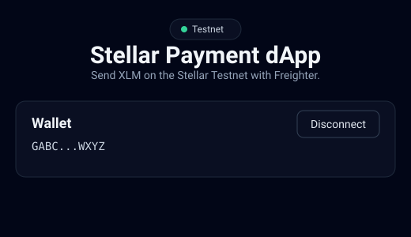
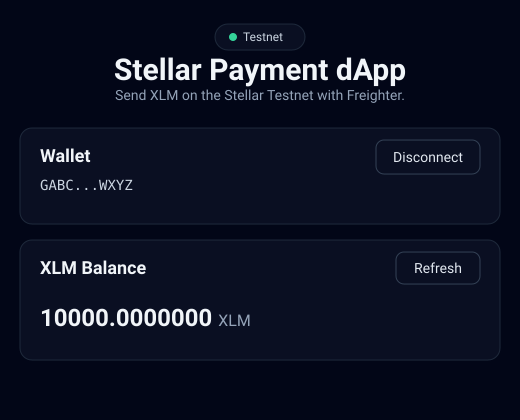
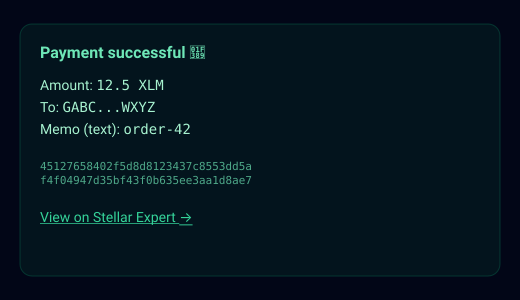
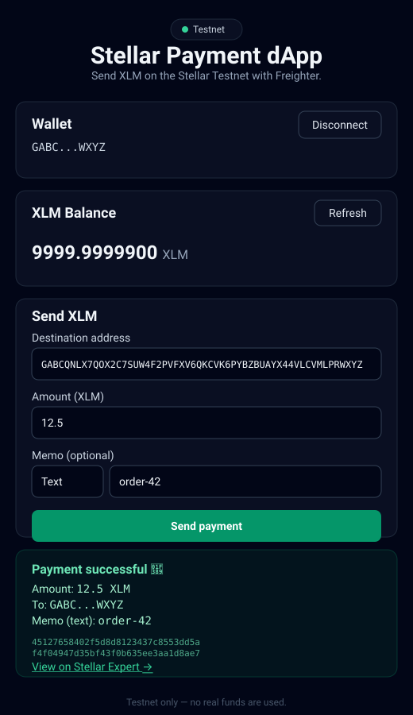

# Stellar Payment dApp

A minimal payment dApp that lets you send XLM on the **Stellar Testnet** using
the [Freighter](https://freighter.app) browser extension wallet.

Built with React (Vite), [`@stellar/freighter-api`](https://www.npmjs.com/package/@stellar/freighter-api)
for wallet integration, and [`@stellar/stellar-sdk`](https://www.npmjs.com/package/@stellar/stellar-sdk)
for blockchain interactions. All network calls target the Testnet Horizon server
(`https://horizon-testnet.stellar.org`).

## Features

- Detects Freighter and warns when it is missing or not set to Testnet
- Connect / disconnect your wallet and shows the truncated address
- Fetches and displays your XLM balance with a refresh button
- Funds unfunded testnet accounts via Friendbot
- Sends XLM payments: build → sign (Freighter) → submit (Horizon)
- Supports an optional memo (text or id) attached to the payment
- Validates the destination address, amount, and memo before submitting
- Shows pending / success (with Stellar Expert link) / failure feedback

## Screenshots

| Wallet connected | Balance displayed |
| --- | --- |
|  |  |

| Successful testnet transaction | Result shown to the user |
| --- | --- |
|  |  |

> These are illustrative SVG mockups. To replace them with real screenshots, run
> the app with Freighter connected, capture each state, save the images into
> `screenshots/`, and update the image paths above.

## Prerequisites

- [Node.js](https://nodejs.org) 20.19+ (or 22.12+)
- A Chromium or Firefox browser with the Freighter extension installed

## 1. Install Freighter

1. Go to <https://freighter.app> and install the extension for your browser
   (Chrome Web Store or Firefox Add-ons).
2. Complete the setup flow and create or import a wallet.

## 2. Switch Freighter to Testnet

1. Click the Freighter icon in your browser toolbar.
2. Open the network dropdown (top of the extension window).
3. Select **Testnet** (not "Public" / mainnet).

> The app will show a warning if Freighter is on the wrong network.

## 3. Fund a test account

Your account needs lumens before it can pay transaction fees.

- Option A: In this app, connect your wallet and click **Fund with Friendbot**
  when the balance shows the account is unfunded.
- Option B: Visit <https://stellar.expert/explorer/testnet> or use Friendbot
  directly at <https://friendbot.stellar.org?addr=YOUR_PUBLIC_KEY>.

## 4. Run the app locally

```bash
# Install dependencies
npm install

# Start the dev server
npm run dev
```

Open the URL printed by Vite (usually `http://localhost:5173`).

### Production build

```bash
npm run build
npm run preview
```

## Project structure

```
src/
  components/
    WalletConnect.jsx      # connect/disconnect + wallet warnings
    BalanceDisplay.jsx     # balance, refresh, and Friendbot funding
    PaymentForm.jsx        # destination + amount inputs with validation
    TransactionStatus.jsx  # pending / success / failure feedback
  lib/
    constants.js           # network passphrase, Horizon + Friendbot URLs
    wallet.js              # Freighter (connect, network, sign) helpers
    stellar.js             # Horizon server, balance, build/sign/submit
    format.js              # address truncation and amount validation
  App.jsx                  # state + wiring
  main.jsx                 # React entry point
screenshots/               # README screenshots (SVG mockups)
```

## Notes

- Testnet only — no real funds are involved.
- The destination account must already exist (be funded) to receive a payment.
